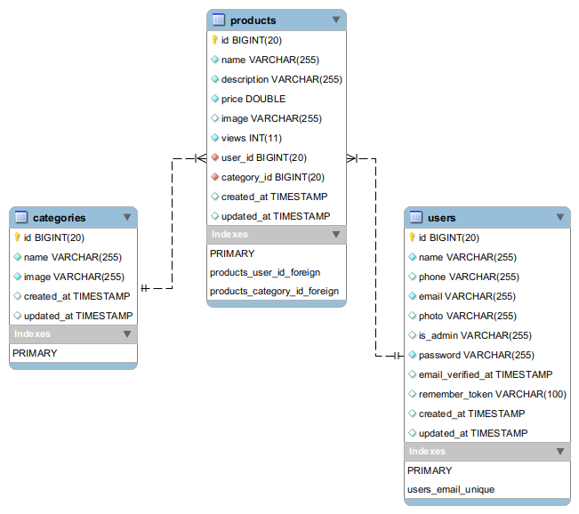

# Projeto Individual: Plataforma de classificados online

Projeto desenvolvido durante o programa DevStart da PayLivre com a BeAcademy.

O tema escolhido foi uma plataforma de classificados online. Onde os usuários podem anunciar produtos (cadastrar), ler a produtos anunciados, atualizar os seus anúncios e apagar. 

O administrador da plataforma consegue cadastrar, listar, atualizar e apagar usuários, também consegue cadastrar, listar, atualizar e apagar categorias de produtos.

A plataforma foi construída com autenticação e o framework CSS escolhido foi bootstrap 5. Os usuários podem buscar por produtos anunciados e listar os produtos por categorias.

Foi implementado um contador de visitas para cada produto, para que cada usuário saiba quantas visitas o seu produto teve.

O administrator recebe um dashboard especial onde consegue gerenciar todos os usuários, produtos e categorias da plataforma. O usuário comum recebe no seu dashboard o controle dos seus produtos anunciados.

## Requisitos do projeto

- [x] Criar um CRUD em PHP, utilizando Laravel

- [x] O sistema deverá possuir autenticação

- [x] Utilizar o banco de dados Mysql para criar uma tabela - de sua preferência, com 10 atributos

- [x] O CRUD deve conter os métodos de Insert, Update, Delete e Read dessa tabela

- [x] As ações deverão ser realizadas através de uma página web, portanto o sistema deverá conter um frontend que se comunique com o backend

- [x] A solução deve ter pelo menos 30% de testes unitários

- [x] O projeto deverá ser armazenado no repositório do github

## Deploy

A plataforma escolhida para deploy da aplicação foi a Heroku:

https://projeto-classificados.herokuapp.com/

## Tecnologias

- PHP 8.1

- Laravel 9

- MySQL / MariaDB

## Modelagem do banco de dados

## Telas do projeto

### Página inicial

### Página de produto

#### Opção de ver detalhes do produto

Ao clicar na imagem do produto o cliente pode ver detalhes.

### Página de produtos de cada categoria

### Página de busca por produtos

### Página de cadastro de novos usuários

### Página de login

### Dashboard do usuário comum

### Página de anúncio de produtos

### Página de editar anúncio

### Página de editar perfil do usuário

### Dashboard do administrador

### Lista de todos os produtos anunciados na plataforma

### Lista de todas as categorias cadastradas

Categorias disponíveis para usuários cadastrar produtos

### Listar todos os usuários cadastrados na plataforma

### Sidebar para o usuário logado navegar pela plataforma

